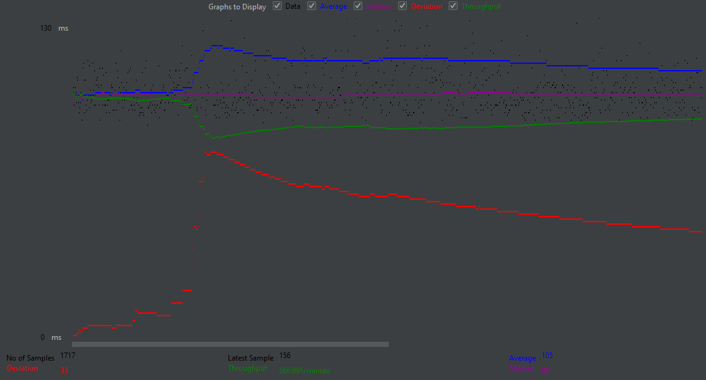

- # General
    - #### Team#: Team 39

    - #### Names: Riley Champion, Luke Holland

    - #### Project 5 Video Demo Link: https://uci.zoom.us/rec/share/WyWyZLvTC1jT7QQpK8gL6s8lS4M9u_Cspx-HrxZvUorgNI1hO_m6xOAm04IzKPzo.zvGvQkOuDCkk_Nrs?startTime=1622959995000

- # Connection Pooling
    - #### Include the filename/path of all code/configuration files in GitHub of using JDBC Connection Pooling.
        - Establish Connection Pool:
            - WebContent/META-INF/context.xml
        - Prepared Statements:
            - src/AddMovieServlet.java
            - src/AddStarServlet.java
            - src/FullSearchServlet.java
            - src/GenreListServlet.java
            - src/LoginServlet.java
            - src/MoviesServlet.java
            - src/PaymentServlet.java
            - src/SingleMovieServlet.java
            - src/SingleStarServlet.java

    - #### Explain how Connection Pooling is utilized in the Fabflix code.
        - Connection Pooling was introduced using our context.xml file, where 3 different resources were used: One for single instance without pooling, one for single instance with pooling, and one for the scaled instance.

    - #### Explain how Connection Pooling works with two backend SQL.
        - Regardless of how many connections are present when using pooling, the requests are sent to the master instance's MySql database, from which the slave will copy what was added to its MySQL database.

- # Main/Follower
    - #### Include the filename/path of all code/configuration files in GitHub of routing queries to Master/Slave SQL.
        - WebContent/META-INF/context.xml

    - #### How read/write requests were routed to Main/Follower SQL?
        - All write requests were sent to the main, while read requests could be sent to either the main or the follower.

- # JMeter TS/TJ Time Logs
    - #### Instructions of how to use the `log_processing.*` script to process the JMeter logs.
        - To run the python file which calculates TS and TJ from task 4, use the following command: python3 log_processing.py ./logs/search_servlet_log.txt
        - For multiple runs, make sure to remove/rename the current search_servlet_log.txt file to another name then recreate a new file named "search_servlet_log.txt"

- # JMeter TS/TJ Time Measurement Report

| **Single-instance Version Test Plan**          | **Graph Results Screenshot** | **Average Query Time(ms)** | **Average Search Servlet Time(ms)** | **Average JDBC Time(ms)** | **Analysis** |
|------------------------------------------------|------------------------------|----------------------------|-------------------------------------|---------------------------|--------------|
| Case 1: HTTP/1 thread                          |    | 119                         | 12.078                                  | 0.1826                        | Standard Connection Pooling time results. Any seemingly larger than average time would be due to connection speed and processing power of machine.          |
| Case 2: HTTP/10 threads                        |    | 144                         | 12.1095                                  | 0.2027                        | Handling 10 threads at the same time seems to correlate to the result times increasing when compared to Case 1. This may be similar to how processes slow down on one's computer when more resources are taken up.          |
| Case 3: HTTPS/10 threads                       |    | 121                         | 12.2406                                  | 0.3325                        | HTTPS with 10 threads is almost as fast as HTTP with just 1 thread, possibly due to the web browser's extra techniques that are utilized during an HTTPS connection. While more work is put into securing the HTTPS connection (which might make initial requests slower) any subsequent would theoretically run faster.            |
| Case 4: HTTP/10 threads/No connection pooling  |    | 129                         | 12.4769                                  | 0.4490                        | In theory, connection pooling should make these requests much faster. Much of the delay in servlet search time for this case, and for the previous cases, comes from the extra time it takes for actions involving JDBC. Caching and maintaining more connections should also be faster with more threads, but these results seem to suggest otherwise.          |

| **Scaled Version Test Plan**                   | **Graph Results Screenshot** | **Average Query Time(ms)** | **Average Search Servlet Time(ms)** | **Average JDBC Time(ms)** | **Analysis** |
|------------------------------------------------|------------------------------|----------------------------|-------------------------------------|---------------------------|--------------|
| Case 1: HTTP/1 thread                          |    | 107                         | 14.120                                  | 0.2183                        | Scaled instance query times may be faster due to the division of resouces between the master and slave, compared to the single instance, which must perform every task itself.            |
| Case 2: HTTP/10 threads                        |    | 105                         | 13.9270                               | 0.2513                      | Unlike the single instance tests, the average query time for multiple threads was down compared to only 1 thread. It was expected that time would increase just like for single instance. This discrepancy may be due to slowdown on the single instance test cases, since there was only one machine to process requests from, unlike here.           |
| Case 3: HTTP/10 threads/No connection pooling  |    | 103                         | 14.770                                  | 1.0690                        | One reason as to why JDBC took significantly longer to run than normal may be that the time it takes to redirect the requests from the load balancer to the master/slave (i.e. send the requests to different machines) is longer compared to single instance.            |

